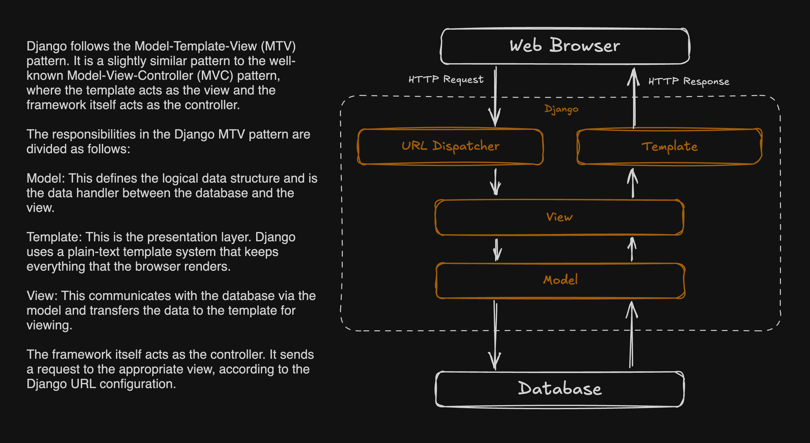

# DjangoBlogify

Hey there, fellow developers! 👋 Welcome to DjangoBlogify, your go-to Django project for building a blogging platform.

## What's the deal?

Blogging's an awesome way to get your feet wet with Django. It's got a bit of everything:

- Content management
- User interactions (comments)
- Sharing posts (spread the love)
- Recommending similar posts (one good read deserves another)

## What are we building?

We're creating a blog app with these features:

- A list of posts showing:
  - Title
  - Publish date
  - Author
  - A teaser of the post
  - A "Read more" link

- A detailed view for each post with:
  - All the above stuff
  - The full post content

## How are we doing this?

1. Set up our Django project and create a blog app
2. Design our data models and sync them with the database
3. Build an admin site
4. Create views, templates, and URLs

Feel free to suggest improvements or just say hi!

